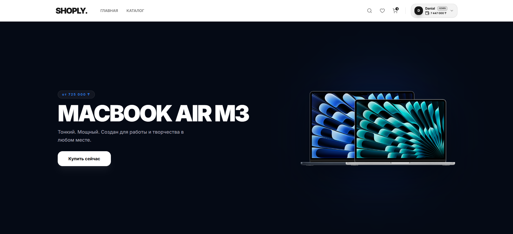
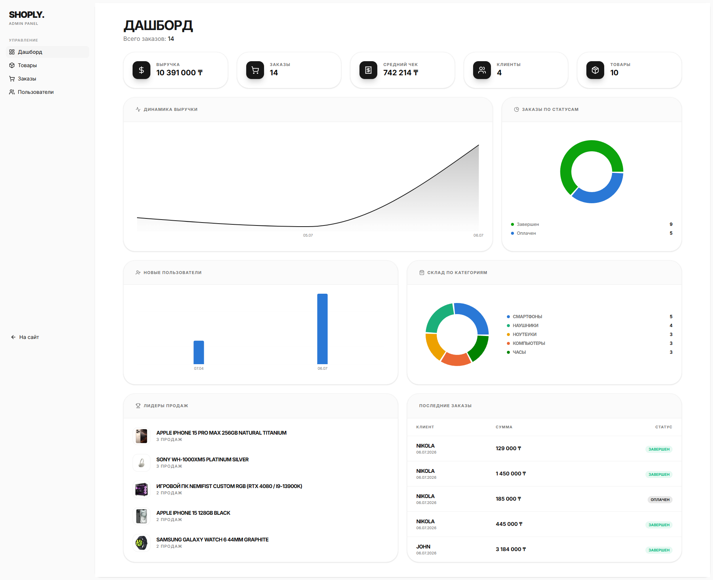
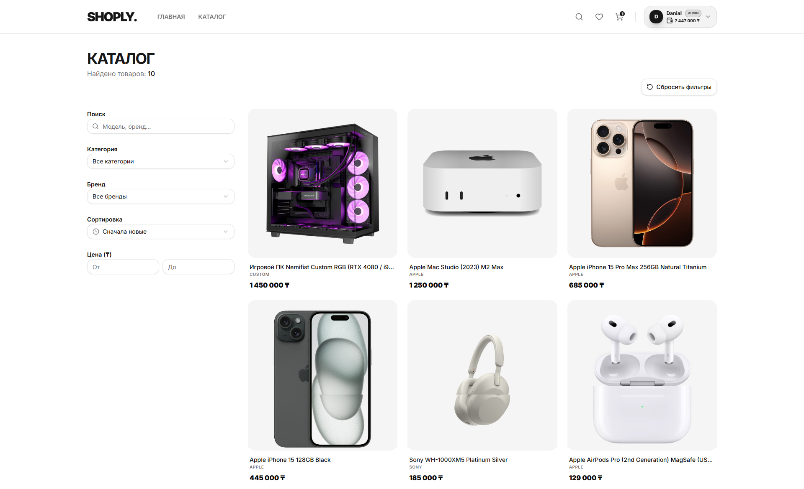
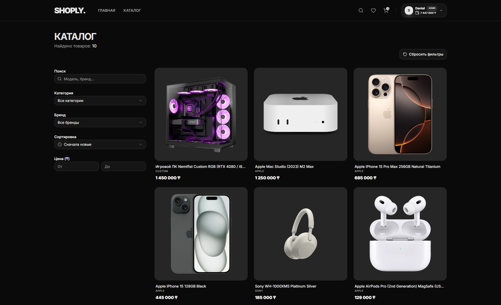

# 🛒 Shoply — Fullstack E-Commerce Platform

A complete online store built from scratch with Next.js and Express — catalog with search & filtering, cart & checkout, an internal wallet system, a full admin dashboard, and a security-hardened backend (server-side price validation, atomic transactions, CSRF protection, idempotent checkout).



[](#-testing)


## 🔗 Live Demo

<!-- TODO: verify this is still live and points at a working backend before sharing -->
https://shoply-cyan.vercel.app

## 📸 Screenshots

**Cart & Checkout**


**Admin Dashboard**



**Light / Dark theme**

<p align="center">
  
  
</p>

## ✨ Features

- 🔍 **Catalog** — search with debounce, category/brand/price filters, sorting, pagination.
- ⌘K **Command-palette search** — instant product search from anywhere in the app.
- 🛍️ **Cart & checkout** — quantity controls, address form, wallet-based payment.
- ❤️ **Favorites**, order history, editable profile with avatar upload.
- 🛠️ **Admin panel** — product/order/user management, sales analytics dashboard (Recharts), balance top-ups.
- 🌗 **Light / dark / system theme**, fully responsive (bottom tab bar on mobile).
- 💰 **Internal wallet** — top up and pay for orders from an in-app balance.

## 🔐 Security highlights

This isn't just CRUD with a login form — a few things were deliberately hardened past the "tutorial" level:

- **Server-side price recomputation** — the checkout endpoint never trusts a price sent by the client; every order's total is recalculated from the product prices stored in the database.
- **Atomic MongoDB transactions** — stock decrements and balance changes happen inside a real multi-document transaction, so a failed payment can't leave stock silently deducted, and concurrent orders can't oversell.
- **Idempotency keys** — the client sends a one-time key per checkout attempt; retrying after a dropped response (flaky network, double-click, two open tabs) returns the original order instead of creating and charging a duplicate.
- **httpOnly cookie auth + CSRF double-submit** — the JWT is never exposed to JavaScript (immune to token theft via XSS); a separate readable cookie is echoed back in a header on every mutating request to prove it came from the app's own frontend.
- **Input validation & rate limiting** — Zod schemas on every write endpoint, `express-rate-limit` on auth routes, `helmet` security headers.
- **Race-condition-safe balance operations** — top-ups/withdrawals use atomic `$inc` with a conditional filter, not read-then-write, so two concurrent requests can't both pass an "enough funds" check against the same stale balance.

## 🚀 Tech Stack

### Frontend

- **Next.js 16** (App Router) + **TypeScript** (strict)
- **TanStack Query** — server-state caching/invalidation
- **Zustand** — client state (cart, favorites, auth), persisted to `localStorage`
- **shadcn/ui + Radix UI + Tailwind CSS 4**
- **next-themes** — light/dark/system theme
- **Axios** — cookie-based auth (`withCredentials`), automatic CSRF header

### Backend

- **Node.js + Express 5** + **TypeScript** (strict)
- **MongoDB + Mongoose** — transactional writes for orders/balance
- **Zod** — request validation
- **JWT in httpOnly cookies** + CSRF double-submit
- **Vitest + Supertest + mongodb-memory-server** — integration tests against a real (in-memory) replica set
- **Helmet, express-rate-limit, cookie-parser**

## 🏗️ Project Structure

```
shoply/
├── docker-compose.yml      # mongo (replica set) + backend + frontend, one command
├── backend/
│   ├── Dockerfile
│   ├── src/
│   │   ├── controllers/    # request handlers (+ __tests__)
│   │   ├── models/         # Mongoose schemas
│   │   ├── routes/
│   │   ├── middleware/     # auth, CSRF, validation, rate limiting (+ __tests__)
│   │   ├── validators/     # Zod schemas
│   │   ├── utils/          # JWT/cookie helpers
│   │   ├── config/         # DB connection
│   │   └── test/           # test DB helper (in-memory replica set)
│   └── .env.example
└── frontend/
    ├── Dockerfile
    ├── app/                # Next.js App Router pages
    │   ├── (store)/        # storefront routes — own layout (Navbar/Footer)
    │   └── admin/          # admin routes — own layout (sidebar)
    ├── components/
    │   ├── ui/             # shadcn/Radix primitives
    │   ├── admin/           # tables & dialogs for the admin panel
    │   ├── layout/          # Navbar, Footer, AdminSidebar, MobileNav, UserMenu
    │   ├── modals/          # auth modal, ⌘K search
    │   ├── product/         # ProductCard, HeroSlider
    │   ├── providers/       # Query/Auth/Theme providers
    │   ├── skeletons/       # loading placeholders
    │   └── home/            # homepage sections
    ├── hooks/              # page logic (catalog filters, checkout, forms, search)
    ├── store/              # Zustand stores (cart, favorites, auth)
    ├── lib/                # axios client, query client, theme, utils
    └── .env.example
```

## ⚡ Quick Start

### Option A — Docker (one command, includes the database)

Requires [Docker](https://docs.docker.com/get-docker/) with Compose.

```bash
git clone https://github.com/Dqnial/shoply.git
cd shoply
cp .env.example .env   # optional — sets JWT_SECRET; a dev default is used otherwise

docker compose up --build
```

Frontend: [http://localhost:3000](http://localhost:3000) · Backend: [http://localhost:5000](http://localhost:5000)

This spins up MongoDB as a single-node **replica set** (required — the app uses multi-document transactions, which a standalone `mongod` doesn't support), auto-initializes it, then builds and starts the backend and frontend. Uploaded images and the database persist in Docker volumes across restarts (`docker compose down -v` to wipe them).

### Option B — Run locally without Docker

**Prerequisites:** Node.js 20+, and a MongoDB connection string — either [MongoDB Atlas](https://www.mongodb.com/cloud/atlas/register) (free tier works, already a replica set) or your own local replica set.

```bash
git clone https://github.com/Dqnial/shoply.git
cd shoply

cd backend && npm install && cp .env.example .env
# fill in MONGODB_URI and JWT_SECRET in backend/.env

cd ../frontend && npm install && cp .env.example .env.local
```

Then, in two terminals:

```bash
# terminal 1
cd backend && npm run dev

# terminal 2
cd frontend && npm run dev
```

## 🧪 Testing

```bash
cd backend
npm test
```

Runs integration tests (Vitest + Supertest) against a real in-memory MongoDB **replica set** — the same transactional code paths run in tests as in production, including concurrency scenarios like two simultaneous withdrawal requests racing against the same balance.

Currently covered: order creation (price/stock integrity, insufficient funds, idempotency), balance operations (atomic top-up/withdrawal, concurrent-request race), request validation, and CSRF enforcement.

## 🗺️ Roadmap

- [ ] Real payment gateway integration (currently wallet-only; card payment is a disabled placeholder)
- [ ] Broader test coverage (product/user controllers, frontend)
- [ ] CI pipeline (lint + typecheck + tests on push)

## 📄 License

[MIT](LICENSE)
